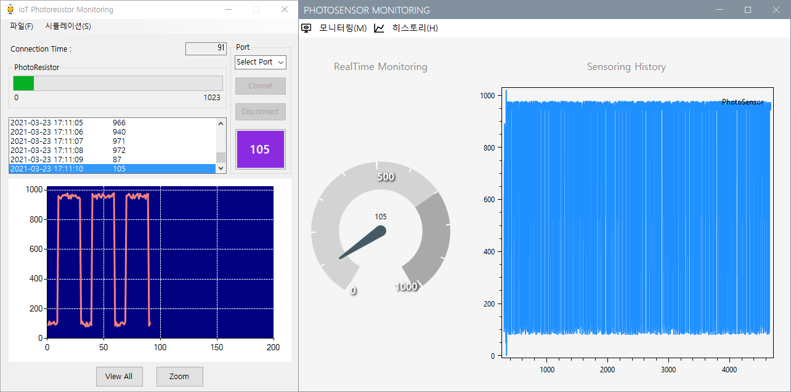

# StudyDesktopApp
C# 데스크톱 앱 개발 학습 리포지토리

## Winform 책 대여 관리

1. 로그인 폼 

 [코드](WinformApp/WinFormAdvancedBank/BookRentalShopApp/FrmLogin.cs)

2. 도서 분류 코드 관리 
  - Insert, Update, Delete

 [코드](WinformApp/WinFormAdvancedBank/BookRentalShopApp/FrmDivCode.cs)

3. 도서 관리 
  - Insert, Update, Delete

 [코드](WinformApp/WinFormAdvancedBank/BookRentalShopApp/FrmBooks.cs)

4. 회원 관리 
  - Insert, Update, Delete

 [코드](WinformApp/WinFormAdvancedBank/BookRentalShopApp/FrmMember.cs)

5. 도서 대여 관리 
  - Insert, Update

 [코드](WinformApp/WinFormAdvancedBank/BookRentalShopApp/ref_images/RentalForm.png)

  * 대여할 회원 선택

     [코드](WinformApp/WinFormAdvancedBank/BookRentalShopApp/FrmMemberPopup.cs)
    
  * 대여할 도서 선택

     [코드](WinformApp/WinFormAdvancedBank/BookRentalShopApp/FrmBooksPopup.cs)

-----

PhotoResistor

