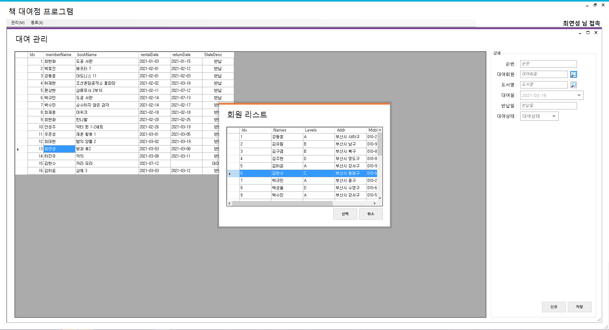

# StudyDesktopApp
C# 데스크톱 앱 개발 학습 리포지토리
- [책 대여 관리 앱](#책-대여-관리-앱)
- [포토 레지스터](#photoresistor)
- [NLog](#nlog)
- [SQL Connection](#sqlconnection-클래스)
----------

## 책 대여 관리 앱

1. [로그인 폼](WinformApp/WinFormAdvancedBank/BookRentalShopApp/FrmLogin.cs) 

    </img>

2. [도서 분류 코드 관리](WinformApp/WinFormAdvancedBank/BookRentalShopApp/FrmDivCode.cs)
    - 구분 코드에 대한 CRUD 구현
    
    </img>

3. [도서 관리](WinformApp/WinFormAdvancedBank/BookRentalShopApp/FrmBooks.cs)
    - 도서 정보에 대한 CRUD 구현

    </img>
    
4. [회원 관리](WinformApp/WinFormAdvancedBank/BookRentalShopApp/FrmMember.cs)
    - 회원 정보에 대한 CRUD 구현

    </img>
    
5. [도서 대여 관리](WinformApp/WinFormAdvancedBank/BookRentalShopApp/ref_images/RentalForm.png)
    - 도서 정보와 회원 정보를 결합하여 대여 현황 조회, 추가 기능

    </img>

    * [대여할 회원 선택](WinformApp/WinFormAdvancedBank/BookRentalShopApp/FrmMemberPopup.cs)

    </img>
    
    * [대여할 도서 선택](WinformApp/WinFormAdvancedBank/BookRentalShopApp/FrmBooksPopup.cs)

    </img>

-----

## PhotoResistor

</img>

1. [photo resister monitering](WinformApp/WinFormAdvancedBank/IoTSensorMonApp)
    - WinForms
    - 포토 레지스터 : 광의존 저항기(LDR)
    - 초단위로 센서값을 랜덤으로 생성해서 실시간 값을 그래프로 표시하고 DB에 저장(INSERT)

2. [photo sensor monitering](WPFApp/WpfAdvBank/PhotoSensorMonApp)
    - WPF
    - DB에 저장된 센서값을 가져와(SELECT) 실시간으로 모니터링

---

- <h3>NLog</h3>

```C#
/* NLog file 형식 지정 */

<targets>
	<target name="console" xsi:type="ColoredConsole"
			layout="${date:format=HH\:mm\:ss}| [TID:${threadid}] | ${stacktrace} | ${message}" />
	<target name="file" xsi:type="File" fileName="${basedir}/Logs/${date:format=yyyyMMdd}.log"
			layout="[${date}] [TID:${threadid}] [{stacktrace}]: ${message}" />
</targets>
```

- <h3>SqlConnection 클래스</h3>

```C#
/* SqlConnection 클래스로 SQL 서버 접속 */
List<DataPoint> result = new List<DataPoint>();
try
{
    using (SqlConnection conn = new SqlConnection(connString))
    {
        if (conn.State == System.Data.ConnectionState.Closed) conn.Open();

        var query = $@" /* SELECT QUERY */ ";

        SqlCommand cmd = new SqlCommand(query, conn);
        SqlDataReader reader = cmd.ExecuteReader();

        while (reader.Read())
        {
            /* SELECT된 데 처리 */
        }
    }

```
